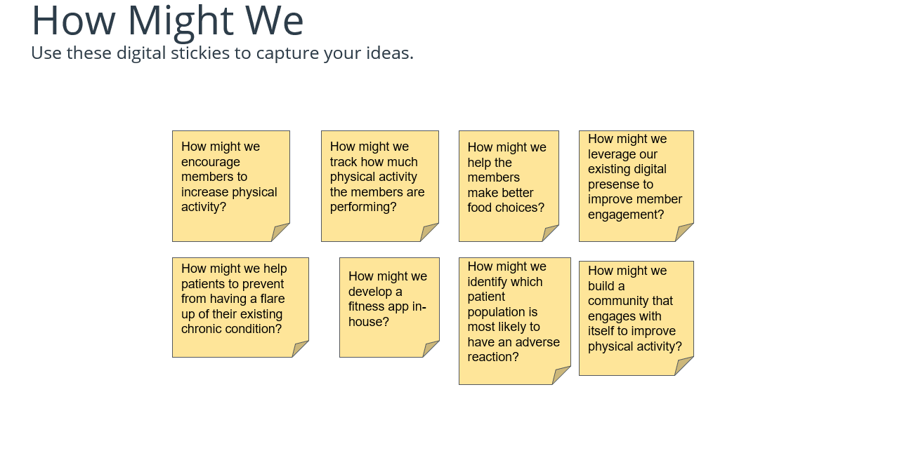
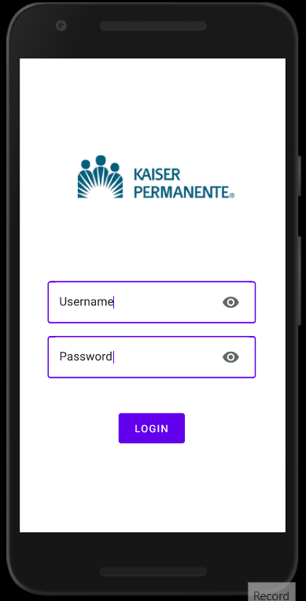
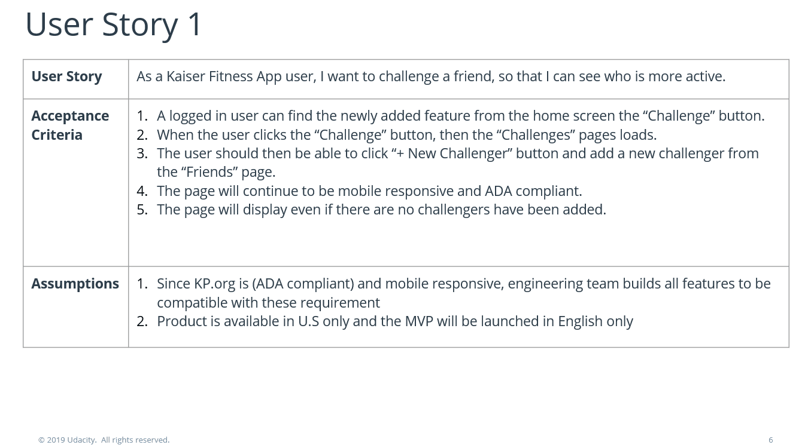

# 1. Objective

#### This repository has some of the fun projects that I have been working on. The projects are related to Product Management Skills, Data Science, and AI. Feel free to look around.

# 2. Design Sprint: "How Might We"
##### During a Design Sprint, “How Might We” is a method to capture problems and frame them as opportunities that can be solved. Post-it notes are used to capture the "How Might We" statements. Each post-it has one statement.

# 3. Storyboarding
##### [plot.io](https://theplot.io/) is a great tool for storyboarding. The first frame of a storyboard should articulate the problem. The last frame should show how your product helped the user solve the problem. The frames in between the first and last frame should show how the user gets from the problem to the solution. 

# 4. Prototyping with Figma
##### Using Figma to develop a mock prototype of a fitness app. This fitness app which tracks users activity and allows the users to challenge their friends to a see who is more physically active. It also shows visual trends of activity, weight, water consumption, and sleep. [Click here](https://www.figma.com/file/adgPzMaM1NjwhqVtFeguuW/Kaiser-Fitness-App?node-id=0%3A1) to view the prototype. 

# 5. User Stories and Sprint Planning
##### Below are examples of user stories for a new fitness app feature. The user stories include  acceptance criteria and assumptions. The user stories are incorporated to identify Sprint Backlog and Sprint Goal, during the Sprint planning meeting. 

# 6. Data Science Project
##### Like working with youth athletes? Want to open a new Physical Therapy clinic in NYC? Not sure of exactly where to open a clinic? This project uses data science to identify the most central and cost-effective location in the "Big Apple". This project utilizes geopy python client, K-means calculations, and data visualizations tools to find the ideal location for a new clinic. 

